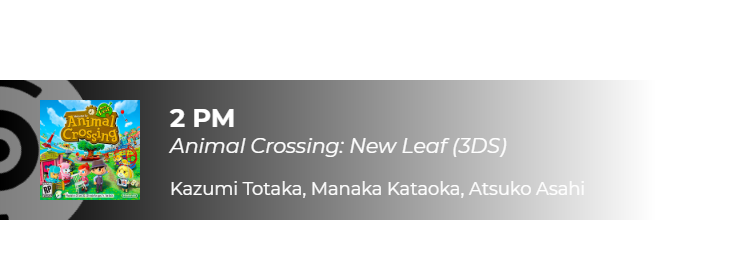

# NowPlayingWidget
 An animated stream widget to display the current playing track


## Requirement
- Tuna :
- Or anything that can fetch the cover and the full information about a track and export it to a .txt file

## How to use
- In Tuna, add a new "Song info output" next to the "widget.html" file.
- Make sure the "Song format" is set to **%t|%a|%m** (Song Title | Album title | Artist) and set the file name to **"FullInfo.txt"**
- In Tuna, set the cover path to be next to "widget.html" and make sure to use the "cover.png" for the filename
- In OBS add a new "Browser Source" and open the "widget.html" file
- After about 1s, if Tuna is running, you will see the widget !

## Customization
If you are savy or better at HTML, JS and CSS than me, feel free to change the file to your liking.

Otherwise, here are some "easy" parameters you cas set in the "Custom CSS" section of the Browser Source :

```css
html {
    font-family: 'XXX'; /* Replace with any font of your choice  */
    color: white; /* Set the base color for all texts */
}

#musicbg {
    fill : white; /* This set the rotating disc color */
}

#track {
    color: inherit; /* Set the "Track" text color */
}
#album {
    color: inherit; /* Set the "Track" text color */
}
#artist {
    color: inherit; /* Set the "Track" text color */
}
```